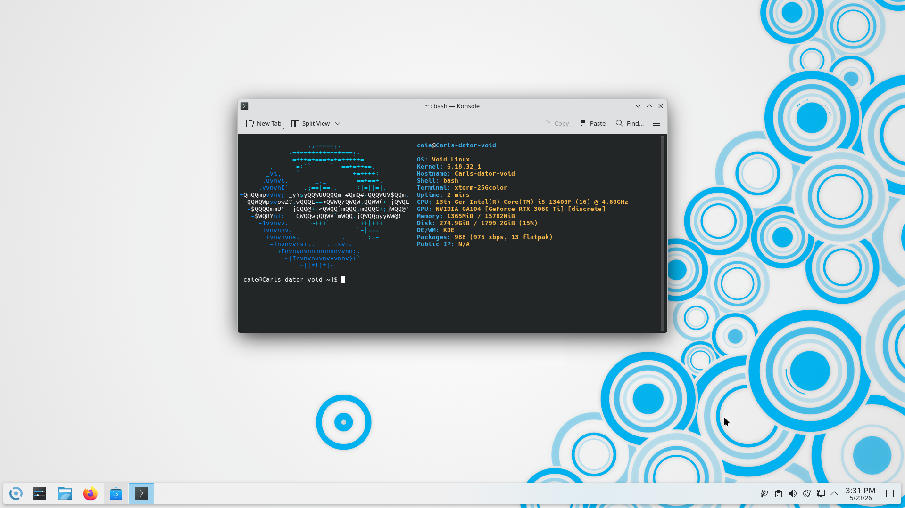
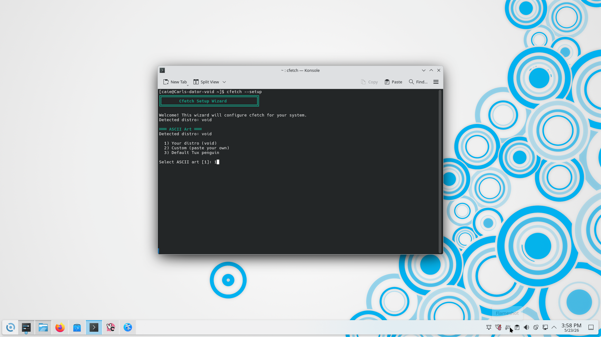
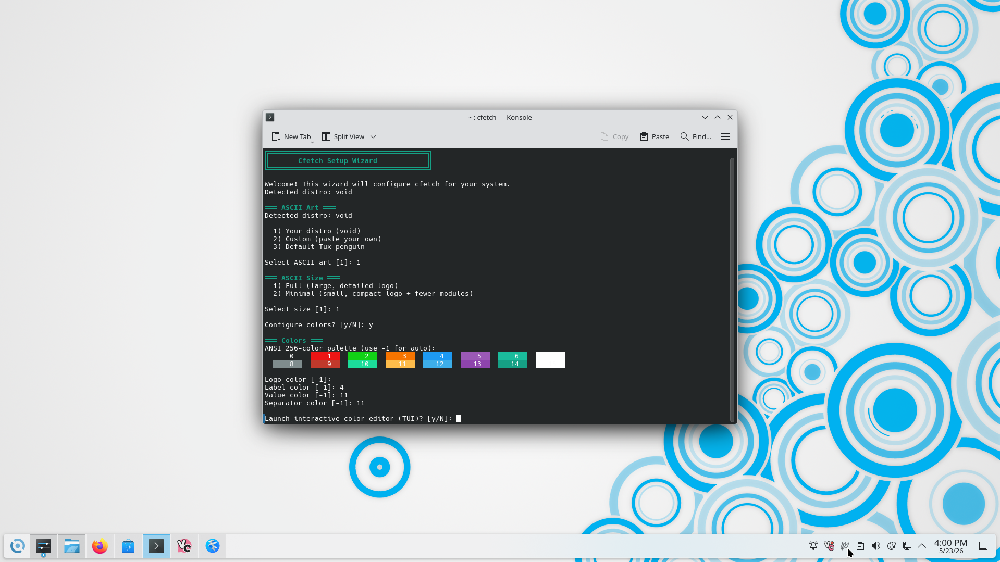
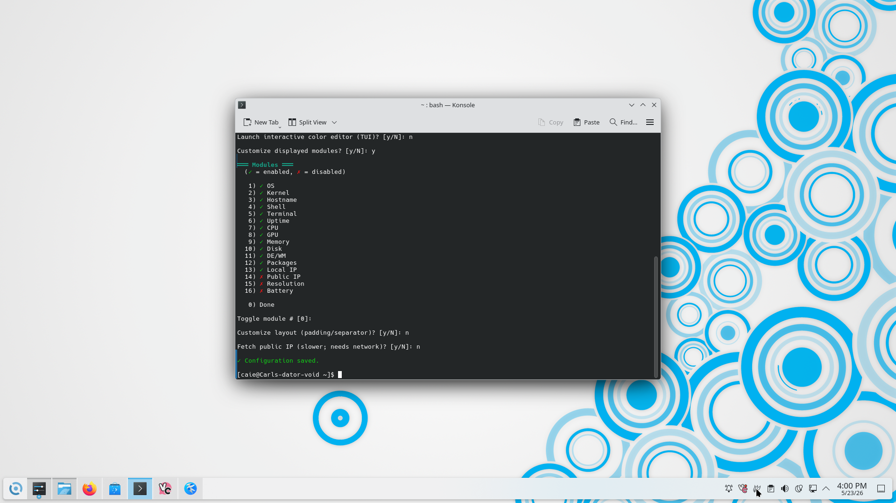
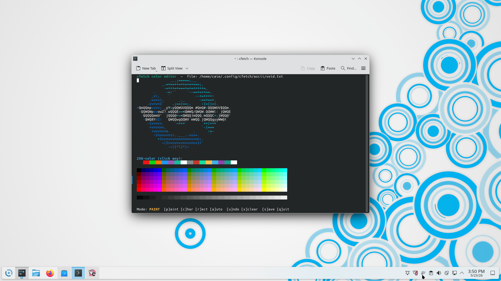

# cfetch

A system info tool written in C. No runtime dependencies, no electron, no python — just compile and run.



## what it does

- reads system info in parallel (pthreads) so slow things like GPU/packages/network don't block each other
- logos for ~150 distros baked into the binary at build time — no asset folder needed at runtime
- two logo sizes: full (neofetch-style) and minimal (pfetch-style)
- interactive setup wizard on first run
- color editor TUI for hand-painting your logo with mouse support
- detects basically every package manager: xbps, dpkg, pacman, rpm, flatpak, snap, pip, npm, cargo, gem, etc.
- custom fields — static key/value pairs or arbitrary shell commands
- `--json` output if you want to pipe it somewhere

---

## install

**dependencies:** just `gcc` (or any C11 compiler) and `make`. pthreads is part of libc on Linux.

```sh
git clone https://github.com/Caie6969/cfetch
cd cfetch
make
sudo make install
cfetch
```

That puts `cfetch` in `/usr/local/bin`. If you want it somewhere else:

```sh
make install PREFIX=~/.local
```

First run will drop you into the setup wizard automatically. To re-run it later: `cfetch --setup`

---

## setup wizard

On first launch cfetch walks you through picking your ASCII art, size, colors, and which modules to show. Takes about 30 seconds.







---

## custom modules

cfetch lets you add your own fields — either static key/value pairs or live shell commands that run on every fetch.


During the setup wizard (or when you re-run `cfetch --setup`), you'll be prompted to add custom modules. Choose a label, then decide whether it's a static value or a shell command. Commands are run at fetch time and their stdout becomes the displayed value.


In the example above, a `Date` module is added using `date +"%Y-%m-%d %H:%M:%S"` — it shows the current date and time on every run.

You can also hand-edit custom fields directly in `~/.config/cfetch/config`:

```ini
custom_static=Editor|neovim
custom_cmd=Date|date +%Y-%m-%d
custom_cmd=Weather|curl -s wttr.in?format=3
```

The format is `label|value` for static fields and `label|command` for shell commands. Multiple `custom_static` and `custom_cmd` lines are supported and displayed in the order they appear.

---

## color editor

`cfetch --color-editor` opens a TUI for painting your logo. Click a color from the 256-color palette, then click glyphs in the logo to paint them. Colors get saved to a `.colors` sidecar file next to your ASCII art and applied automatically on every run.



**keyboard shortcuts:**

| key | what it does |
|-----|-------------|
| `p` | paint mode — one glyph at a time |
| `c` | paint-by-character — paints every matching glyph |
| `r` | rectangle mode — click two corners |
| `a` | auto-segment — assigns colors by glyph class |
| `1` / `2` / `T` | switch to 16-color / 256-color / truecolor palette |
| `u` | undo |
| `x` | clear all colors |
| `s` | save and quit |
| `q` / Esc | quit without saving |

---

## usage

```sh
cfetch                  # run it
cfetch --setup          # redo the setup wizard
cfetch --colors         # open the color editor
cfetch --color-editor   # alias for --colors
cfetch --no-color       # plain output, no escape codes
cfetch --json           # json output
cfetch --help
cfetch --version
```

---

## config

Lives at `~/.config/cfetch/config`. The setup wizard writes this for you, but it's plain text and easy to hand-edit.

```ini
# which distro logo to use
distro_id=void
ascii_path=void
minimal_ascii=false

# colors — -1 means auto, 0-255 is ANSI 256-color
color_logo=-1
color_label=-1
color_value=-1
color_separator=-1

# layout
ascii_width=0       # 0 = auto
padding=2
ascii_right=false
separator=: 

# modules (in display order — remove lines to hide them)
module=OS
module=Kernel
module=Hostname
module=Shell
module=Terminal
module=Uptime
module=CPU
module=GPU
module=Memory
module=Disk
module=DE/WM
module=Packages
module=Local IP
module=Resolution
module=Battery

# custom fields
custom_static=Editor|neovim
custom_cmd=Date|date +%Y-%m-%d
```

Per-logo color overlays live at `~/.config/cfetch/ascii/<name>.txt.colors` — one `row col color` per line, safe to hand-edit or version-control.

---

## building with all distros embedded

By default the build embeds both the pfetch (minimal) and neofetch (full) logo sets. If you want a single flat blob instead:

```sh
make SINGLE_FILE=1
```

---

## project layout

```
cfetch/
├── Makefile
├── ascii/
│   ├── pfetch       # minimal logos
│   └── neofetch     # full logos (~150 distros)
└── src/
    ├── main.c
    ├── config.c/h
    ├── sysinfo.c/h
    ├── setup.c/h
    ├── render.c/h
    ├── ascii_extract.c/h
    ├── color_tui.c/h
    ├── gen_blobs.c          # build-time tool, generates embedded_blobs
    └── embedded_blobs.c/h   # generated, not committed
```

---

## license

MIT
